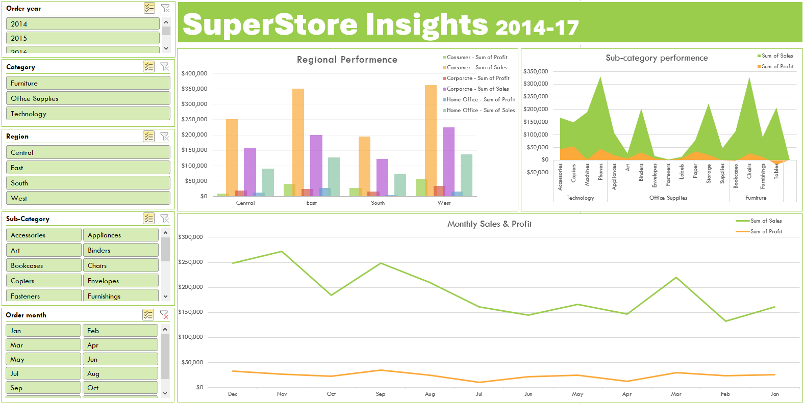

# 📊 Superstore Sales Dashboard (Excel)

This project showcases an interactive sales and profitability dashboard built in Microsoft Excel using the [Superstore dataset](https://www.kaggle.com/datasets/vivek468/superstore-dataset-final). It demonstrates key data analysis skills including cleaning, trend analysis, and dashboard design using pivot tables and slicers.

---

## 📂 Files Included

- `Superstore Dashboard.xlsx` – Fully interactive Excel dashboard
- `dashboard.png` – Screenshot of the final dashboard (see below)

---

## 🛠 Tools Used

- Microsoft Excel
- Pivot Tables
- Pivot Charts
- Slicers
- Conditional Formatting
- Data Cleaning & Formatting

---

## 📈 Project Highlights

- Cleaned and standardized inconsistent date formats for proper time-series analysis
- Created derived fields like `Order Month` for monthly trend tracking
- Analyzed **sales and profit by Category, Region, and Customer Segment**
- Built pivot tables and charts to explore:
  - Top-selling categories and sub-categories
  - Monthly sales performance
  - Profitability by region and segment
- Designed an interactive dashboard with slicers to allow dynamic filtering

---

## 🖼️ Dashboard Preview

---

## 💡 Key Insights

- **Technology** had the highest profit margins, though **Office Supplies** drove more volume
- The **Corporate** segment in the **West** region was the most profitable combination
- Sales peaked in **November and December**, indicating strong Q4 seas
